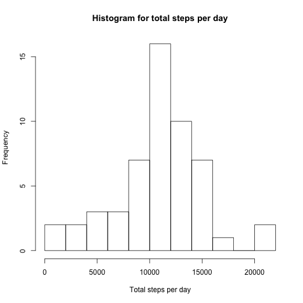
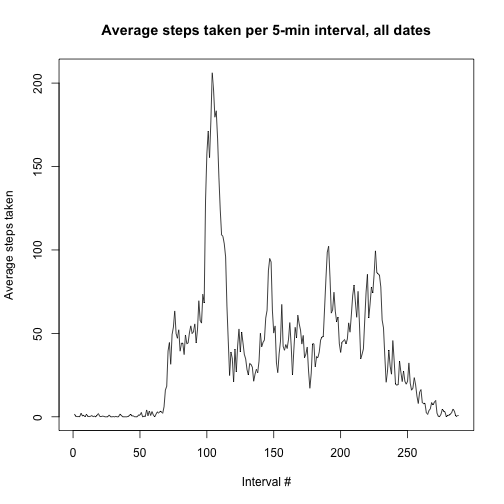
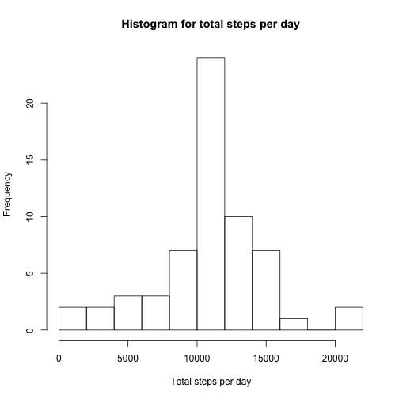
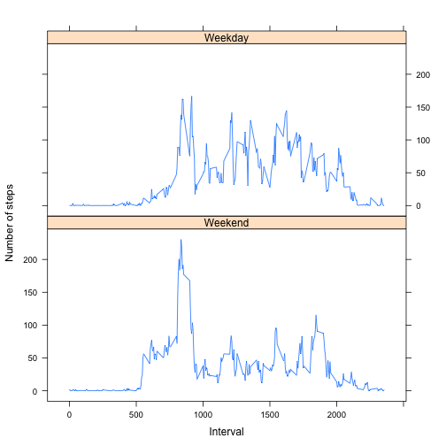

## Loading and preprocessing the data
### Assuming that the downloaded file is in working directory

```r
file <- unzip("activity.zip")
data <- read.csv(file)
```

## What is mean total number of steps taken per day?


```r
total_steps_day <- aggregate(data$steps, by= list(data$date), na.rm = T, FUN = sum)
data_clean <-subset(data, !is.na(data$steps) )
total_per_day <- tapply(data_clean$steps, data_clean$date, sum)
hist(total_per_day, xlab = "Total steps per day", ylab="Frequency", breaks = 10, main="Histogram for total steps per day")
```


###Find the mean and median of total steps per day

```r
summary(total_per_day)
```

```
##    Min. 1st Qu.  Median    Mean 3rd Qu.    Max.    NA's 
##      41    8841   10760   10770   13290   21190       8
```
## What is the average daily activity pattern?

```r
avg_per_interval <- tapply(data_clean$steps, data_clean$interval, mean)

plot(avg_per_interval, 
     type="l", 
     ylab="Average steps taken", 
     xlab="Interval #", 
     main="Average steps taken per 5-min interval, all dates")
```


### Find out which interval has max steps

```r
names(avg_per_interval[which.max(avg_per_interval)])
```

```
## [1] "835"
```
### Find out NA values and its proportion

```r
sum(is.na(data$steps))
```

```
## [1] 2304
```

```r
sum(is.na(data$steps))/nrow(data)
```

```
## [1] 0.1311475
```


## Imputing missing values
### First calculate the mean steps taken per 5-min interval

```r
mean_per_interval <- aggregate(data$steps, by= list(data$interval), na.rm = T, FUN = mean)
```
### Loop through each row in data, imputing the NA value according to mean_per_interval

```r
data_imputed <- data
for (i in 1:nrow(data)){
  if(is.na(data$steps[[i]])){
    ## inner join
    temp_data_impute <- merge(data[i,], mean_per_interval, by.x = "interval", by.y = "Group.1")
    ## populate x into steps
    data_imputed$steps[[i]] <- temp_data_impute$x
    ## clean up
    rm(temp_data_impute)
    }
}
```
### Make a chart

```r
total_per_day_im <- tapply(data_imputed$steps, data_imputed$date, sum)
hist(total_per_day_im, xlab = "Total steps per day", ylab="Frequency", breaks = 10, main="Histogram for total steps per day")
```



```r
summary(total_per_day_im)
```

```
##    Min. 1st Qu.  Median    Mean 3rd Qu.    Max. 
##      41    9819   10770   10770   12810   21190
```

## Are there differences in activity patterns between weekdays and weekends?

```r
data_imputed$as_date <- as.Date(data_imputed$date, "%Y-%m-%d")
data_imputed$weekday <- weekdays(data_imputed$as_date)
weekend <- c("Saturday", "Sunday")

data_imputed$is_weekend <- data_imputed$weekday %in% weekend + 1
data_imputed$is_weekend_factor <- factor(data_imputed$is_weekend, labels = c("Weekend", "Weekday"))

avg_per_interval_weekday <- aggregate(data_imputed$steps, 
                                      by = list(weekend = data_imputed$is_weekend_factor, interval = data_imputed$interval),
                                      FUN = mean) 

library("lattice")
xyplot(x ~ interval | weekend, data = avg_per_interval_weekday,
       type = "l",
       xlab = "Interval", ylab = "Number of steps",
       layout = c(1,2)
       )
```


```
```
```

